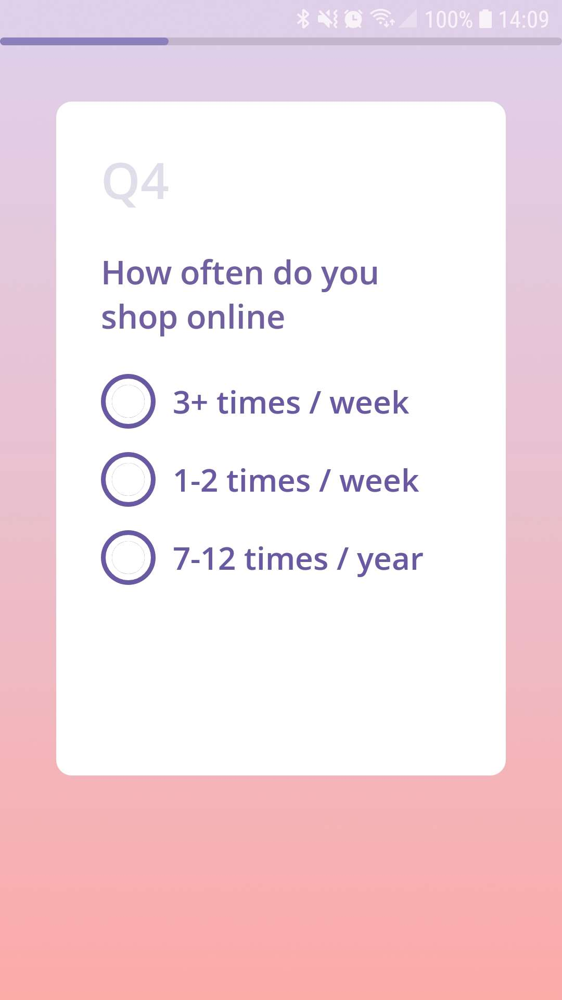
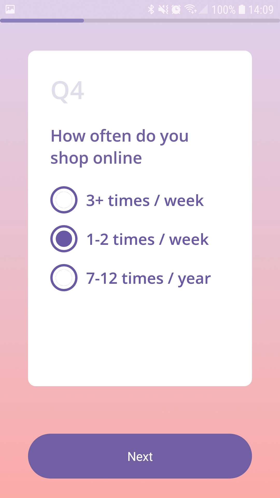
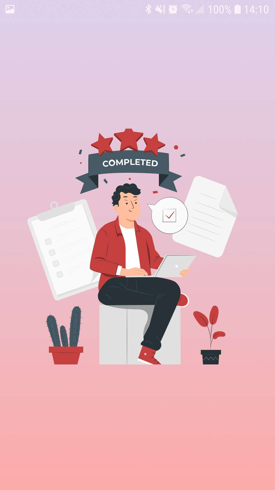
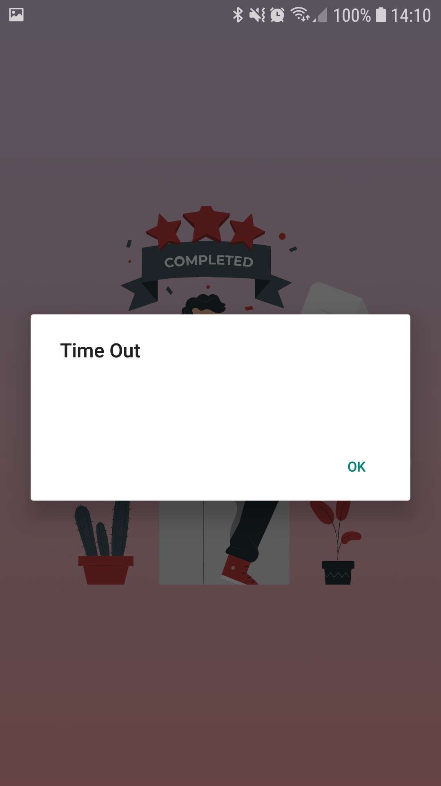

<!-- Improved compatibility of back to top link: See: https://github.com/othneildrew/Best-README-Template/pull/73 -->
<a name="readme-top"></a>

[![Contributors][contributors-shield]][contributors-url]
[![Forks][forks-shield]][forks-url]
[![Stargazers][stars-shield]][stars-url]
[![LinkedIn][linkedin-shield]][linkedin-url]


<!-- PROJECT LOGO -->
<br />
<div align="center">

<h3 align="center">Survey app</h3>
<a href="https://github.com/Novianaa/SurveyApp"><strong>Explore the docs »</strong></a>
</div>


<!-- GETTING STARTED -->
## Getting Started<hr />


### Installation

1. Clone the repo
   ```sh
   git clone https://github.com/Novianaa/SurveyApp.git
   ```
2. Install NPM packages
   ```sh
   npm install
   ```
3. Then, you can running this project with the command below
   ```js
   npm run android
   ```

<p align="right">(<a href="#readme-top">back to top</a>)</p>


<!-- USAGE EXAMPLES -->
## Usage
[Link download app](bit.ly/surveyapp-novia)

| Screen name                                                                                            | Screenshot                                               |
| ------------------------------------------------------------------------------------------------------ | -------------------------------------------------------- |
| The button is not available if you haven't selected an answer                                          |      |
| The button is available if you have chosen an answer.                                                  |  |
| if you have filled out all the questionnaires it will be taken to 'Screen Done'                        |           |
| a 'Time out' alert will appear and will be taken to the Done screen if the processing time has run out |            |


<p align="right">(<a href="#readme-top">back to top</a>)</p>


## Contact

Noviana Rahmawati -  noviana.rahmawati80@gmail.com

Project Link: [https://github.com/Novianaa/SurveyApp](https://github.com/Novianaa/SurveyApp)

<p align="right">(<a href="#readme-top">back to top</a>)</p>


<!-- MARKDOWN LINKS & IMAGES -->
<!-- https://www.markdownguide.org/basic-syntax/#reference-style-links -->
[contributors-shield]: https://img.shields.io/github/contributors/Novianaa/mobile_tickitz.svg?style=for-the-badge
[contributors-url]: https://github.com/Novianaa/SurveyApp/graphs/contributors
[forks-shield]: https://img.shields.io/github/forks/Novianaa/mobile_tickitz.svg?style=for-the-badge
[forks-url]: https://github.com/Novianaa/SurveyApp/network/members
[stars-shield]: https://img.shields.io/github/stars/Novianaa/mobile_tickitz.svg?style=for-the-badge
[stars-url]: https://github.com/Novianaa/SurveyApp/stargazers
[linkedin-shield]: https://img.shields.io/badge/-LinkedIn-black.svg?style=for-the-badge&logo=linkedin&colorB=555
[linkedin-url]: https://www.linkedin.com/in/noviana-rahmawati08/
[product-screenshot]: images/screenshot.png